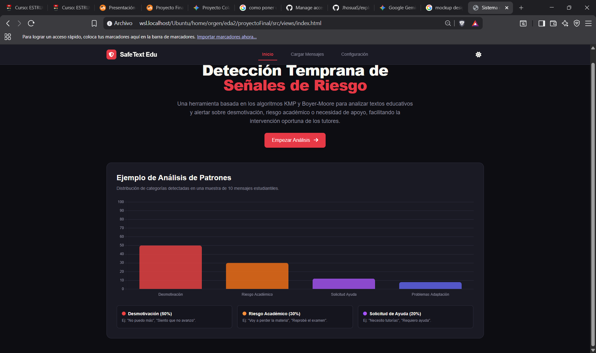
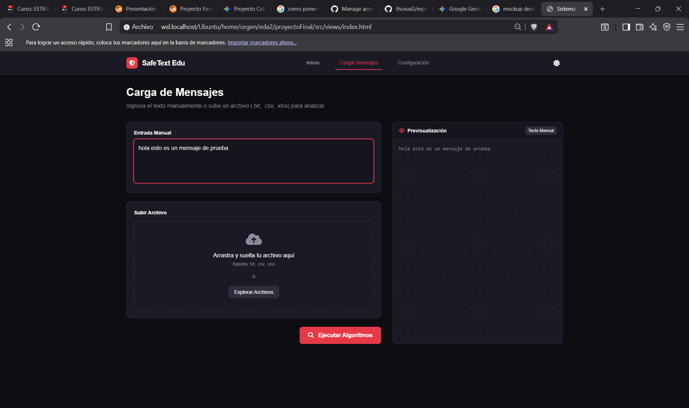

## 1. Nombre del equipo y nombre ficticio de la empresa desarrolladora

- **Nombre del equipo:** Roasted Chicken
- **Empresa desarrolladora** ANDES - *Available and New Development for Easy Software* El enfoque de la empresa ficticia está basado en la identidad de los estudiantes, en conjunto con el desarrollo de software sencillo y accesible usando nuevas tecnologías. Por su traducción al español se puede interpretar como: "Desarrollo nuevo y disponible para software sencillo".

## 2. Introducción

La propuesta de proyecto se basa en el uso de algoritmos de detección de patrones con un enfoque real. A menudo muchos profesionales de la salud mental, departamentos de bienestar o círculos de ayuda se basan en la detección de patrones en el comportamiento, habla o escritura para ofrecer diagnósticos o ayuda adecuada. El propósito del sistema es funcionar como una herramienta de detección temprana y automatización para estos profesionales, así pueden realizar diagnóticos más ágiles, lo que les permitiría un mayor alcance.

## 3. Descripción del problema social o educativo

Los entornos de educación superior a menudo se convierten en espacios propensos para la generación de problemas de salud mental en los estudiantes. Esto fomenta que muchos de los estudiantes decidan por abandonar sus estudios, se estima que en promedio cerca de 150 000 estudiantes abandonan sus carreras cada año [@ecuavisaDesercion] por varios factores como falta de oportunidades, movilidad y adaptación resaltan entre los más comunes. A esto se suma qué muchas veces los estudiantes desconocen de espacios de apoyo, o sienten temor para hablar de su situación y buscar ayuda, por lo que recurren a salidas alternativas como el consumo de sustancias o alcohol, que "forma parte de muchos espacios sociales en la vida universitaria" [@puceConexion]. Estos ambientes permiten que los estudiantes lidien con los problemas ocasionados por la vida universitaria y el estrés, y toman el rol de ambientes de control o liberación. Es común observar cerca de las instalaciones universitarias que los jóvenes acuden a tomar alcohol con este objetivo, un reportaje realizado al 5 de julio de 2026 reveló que hubó un aumento del 70% en el consumo de alcohol entre jóvenes y adolescentes universitarios [@teleamazonas].

## 4. Motivación

El desarrollo de esta herramienta puede facilitar la integración de los estudiantes con entornos de ayuda para la detección temprana de problemas en los espacios educativos, además de luchar contra la deserción y el consumo de alcohol. De igual modo, se puede fomentar el uso de la herramienta entre los estudiantes con una perspectiva basada en la privacidad y objetividad. De este modo los estudiantes pueden compartir sus mensajes a través de la plataforma y pueden ser puestos en contacto con profesionales que se guíen de los patrones detectados para ofrecer la guía y ayuda oportuna a cada estudiante, el anonimato sigue presente ya que la plataforma no recupera datos personales sobre los involucrados y se garantiza el principio de no divulgación por parte de los profesionales.

## 5. Objetivos

- Desarrollar un sistema de ayuda para el diagnóstico de problemas de salud mental y factores de riesgo en estudiantes universitarios para generar un diagnóstico ágil de tutores y profesionales mediante la detección de patrones en textos y mensajes.
- Presentar un prototipo de aplicación relacionado al proyecto mediante el uso de herramientas de IA para reconocer sus límites y oportunidades de uso.
- Proponer ideas de mejora y soluciones alternativas a la problemática planteada a través de herramientas de procesamiento de lenguaje natural para mejorar y evaluar que tan viable es el sistema en el mercado.

## 6. Diseño general de la solución

## 7. Conjunto de patrones

## 8. Descipción de los algoritmos KMP y Booyer-Moore

### 8.1. KMP

KMP es un algoritmo de coincidencia de patrones que se apoya en el uso de una función externa como función de falla, `failure` para este proyecto. La función pre-procesa el/los patron/es para determinar los prefijos más largos que se pueden formar dentro del patrón [@brown]. Esto facilita que el algoritmo reduzca el número de comparaciones que se hacen para hallar coincidencias dentro un texto. Cada que existe una incongruencia el algoritmo aprovecha la función de falla para desplazar el patrón aprovechando la mayor cantidad posible de carácteres hasta la posición en que se detectó la falta de coincidencia.

### 8.2. Booyer-More

## 9. Implementación y flujo del sistema

#TODO: implementar flujo de funciones del sistema e integración del modelo mvc al finalizar

## 10. Pruebas realizadas

## 11. Comparación de resultados

## 12. Mockups del sistema

{fig-align="center"}

{fig-align="center"}

## 13. Limitaciones de KMP y Booyer-Moore

## 14. Posibles mejoras con IA o NLP

## 15. Impacto ético y social

## 16. Declaración de uso responsable de IA

| **Herramienta** | **Actividad** | **Revisión** | **Responsable** |
|:-----------:|:-----------:|:--------------------------------:|:-----------:|
| [Gemini](https://share.gemini.google/FWFqiGuCsSph) | Distribución de carga de trabajo | Se re-asignó la carga de trabajo para que todos puedan trabajar de manera asíncrona. | Jhosua |
| [Gemini](https://share.gemini.google/FWFqiGuCsSph) | Corrección y guía orientada para el desarrollo de `utils` y `kmp_matcher` | Solicitud de ayuda para la revisión de errores | Jhosua |
| [Gemini](https://share.gemini.google/FWFqiGuCsSph) | Elaboración de maquetado inicial para las vistas de inicio y carga | Se solicitó el diseño bajo indicaciones específicas con consideraciones de diseño de UX/UI para una versión preliminar del sistema, la solución se incluyó directamente en `index.html` | Jhosua |
| [Gemini](https://share.gemini.google/FWFqiGuCsSph) | Generación de archivos `.csv` para análisis | Se determinó las categorías y calidad de los mensajes y patrones generados para ser utilizados en las pruebas | Jhosua |
| [Gemini](https://share.gemini.google/FWFqiGuCsSph) | Generación de formatos de referencia | Revisión del contenido y enlaces colocados antes de ser incluidos | Jhosua |

: Uso responsable de herramientas de IA por cada miembro.

## 17. Conclusiones

## 18. Referencias

::: refs{}
:::