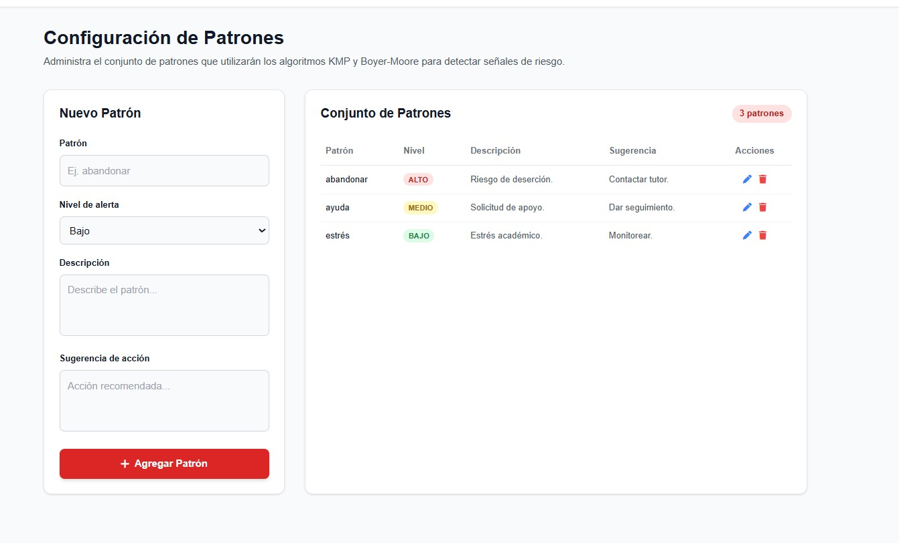
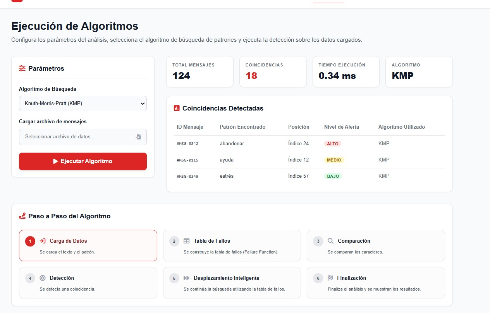

## 1. Nombre del equipo y nombre ficticio de la empresa desarrolladora

- **Nombre del equipo:** Roasted Chicken
- **Empresa desarrolladora** ANDES - *Available and New Development for Easy Software* El enfoque de la empresa ficticia está basado en la identidad de los estudiantes, en conjunto con el desarrollo de software sencillo y accesible usando nuevas tecnologías. Por su traducción al español se puede interpretar como: "Desarrollo nuevo y disponible para software sencillo".

## 2. Introducción

La propuesta de proyecto se basa en el uso de algoritmos de detección de patrones con un enfoque real. A menudo muchos profesionales de la salud mental, departamentos de bienestar o círculos de ayuda se basan en la detección de patrones en el comportamiento, habla o escritura para ofrecer diagnósticos o ayuda adecuada. El propósito del sistema es funcionar como una herramienta de detección temprana y automatización para estos profesionales, así pueden realizar diagnóticos más ágiles, lo que les permitiría un mayor alcance.

## 3. Descripción del problema social o educativo

Los entornos de educación superior a menudo se convierten en espacios propensos para la generación de problemas de salud mental en los estudiantes. Esto fomenta que muchos de los estudiantes decidan por abandonar sus estudios, se estima que en promedio cerca de 150 000 estudiantes abandonan sus carreras cada año [@ecuavisaDesercion] por varios factores como falta de oportunidades, movilidad y adaptación resaltan entre los más comunes. A esto se suma qué muchas veces los estudiantes desconocen de espacios de apoyo, o sienten temor para hablar de su situación y buscar ayuda, por lo que recurren a salidas alternativas como el consumo de sustancias o alcohol, que "forma parte de muchos espacios sociales en la vida universitaria" [@puceConexion]. Estos ambientes permiten que los estudiantes lidien con los problemas ocasionados por la vida universitaria y el estrés, y toman el rol de ambientes de control o liberación. Es común observar cerca de las instalaciones universitarias que los jóvenes acuden a tomar alcohol con este objetivo, un reportaje realizado al 5 de julio de 2026 reveló que hubó un aumento del 70% en el consumo de alcohol entre jóvenes y adolescentes universitarios [@teleamazonas].

## 4. Motivación

El desarrollo de esta herramienta puede facilitar la integración de los estudiantes con entornos de ayuda para la detección temprana de problemas en los espacios educativos, además de luchar contra la deserción y el consumo de alcohol. De igual modo, se puede fomentar el uso de la herramienta entre los estudiantes con una perspectiva basada en la privacidad y objetividad. De este modo los estudiantes pueden compartir sus mensajes a través de la plataforma y pueden ser puestos en contacto con profesionales que se guíen de los patrones detectados para ofrecer la guía y ayuda oportuna a cada estudiante, el anonimato sigue presente ya que la plataforma no recupera datos personales sobre los involucrados y se garantiza el principio de no divulgación por parte de los profesionales.

## 5. Objetivos

- Desarrollar un sistema de ayuda para el diagnóstico de problemas de salud mental y factores de riesgo en estudiantes universitarios para generar un diagnóstico ágil de tutores y profesionales mediante la detección de patrones en textos y mensajes.
- Presentar un prototipo de aplicación relacionado al proyecto mediante el uso de herramientas de IA para reconocer sus límites y oportunidades de uso.
- Proponer ideas de mejora y soluciones alternativas a la problemática planteada a través de herramientas de procesamiento de lenguaje natural para mejorar y evaluar que tan viable es el sistema en el mercado.

## 6. Diseño general de la solución

La arquitectura del sistema se ha diseñado bajo un enfoque modular y desacoplado, inspirado en el patrón Modelo-Vista-Controlador (MVC), lo que permite separar claramente el manejo de datos, la lógica algorítmica de búsqueda y la capa de presentación visual. La solución se estructura de la siguiente manera:

- Capa de Datos (Modelo):Está conformada por archivos estructurados en formato CSV (`messages.csv` y `patterns.csv`) ubicados en el directorio `data/`. Estos archivos almacenan de forma persistente los mensajes de los estudiantes a analizar y el diccionario de patrones de riesgo con sus respectivas categorías y sugerencias de intervención.
- Capa de Lógica de Negocio y Algoritmos (Controladores):Contenida en el directorio `controllers/`, agrupa los módulos especializados en:
- Carga y parseo:Lectura dinámica de los archivos fuente.
- Procesamiento de texto:Funciones de normalización de cadenas (`utils.py`) para estandarizar la comparación de texto.
- Motores de búsqueda:Implementación optimizada de los algoritmos KMP(`kmp_matcher.py`) y Boyer-Moore (`bm_matcher.py`).
- Métricas y reportes:Generación de gráficos y estadísticas de rendimiento (`metrics.py`).
- Capa de Presentación (Vista):Interfaz basada en tecnologías web (HTML/CSS) que permite al usuario interactuar visualmente con el sistema, configurar parámetros y visualizar las alertas detectadas junto con un resumen gráfico.
- Orquestador Central (`main.py`):** Script principal que actúa como punto de entrada, coordinando el flujo completo desde la lectura de los datos hasta la ejecución de los algoritmos y la apertura automatizada del reporte en el navegador.

## 7. Conjunto de patrones

El sistema permite administrar el conjunto de patrones que utilizarán los algoritmos KMP y Boyer-Moore para detectar señales de riesgo dentro de los textos analizados. A través de la interfaz de configuración, el usuario puede registrar nuevos términos o expresiones clave asignándoles una categoría de gravedad y una pauta de actuación.

A continuación, se especifican los campos que estructuran cada registro dentro del sistema, haciendo correspondencia con los elementos del formulario de ingreso:

| Campo | Descripción |
|:---|:---|
| **patron** | Palabra o expresión que será buscada dentro del mensaje. Corresponde al término clave ingresado en el formulario (ej. `abandonar`, `ayuda`, `estrés`). |
| **nivel_alerta** | Nivel de prioridad asignado al patrón, el cual se selecciona mediante un menú desplegable con las opciones: **Alto**, **Medio** o **Bajo**. |
| **descripcion** | Explica detalladamente el significado o la situación de riesgo educativo asociada al patrón detectado (ej. *Riesgo de deserción*, *Solicitud de apoyo*). |
| **sugerencia_accion** | Acción recomendada o protocolo que el tutor o profesional de bienestar debe seguir cuando el patrón es encontrado en el texto (ej. *Contactar tutor*, *Monitorear*). |

### 7.1. Registro actual del sistema

La plataforma cuenta con un módulo visual de gestión ("Conjunto de Patrones") que despliega los elementos activos en la base de datos local (`patrones.csv`). Actualmente, el sistema cuenta con 3 patrones base cargados para las pruebas de coincidencia:

| Patrón | Nivel | Descripción | Sugerencia | Acciones |
|:---|:---:|:---|:---|:---:|
| `abandonar` | ALTO | Riesgo de deserción. | Contactar tutor. | editar/borrar |
| `ayuda` | MEDIO | Solicitud de apoyo. | Dar seguimiento. | editar/borrar |
| `estrés` | BAJO | Estrés académico. | Monitorear. | editar/borrar |

## 8. Descipción de los algoritmos KMP y Booyer-Moore

### 8.1. KMP

KMP es un algoritmo de coincidencia de patrones que se apoya en el uso de una función externa como función de falla, `failure` para este proyecto. La función pre-procesa el/los patron/es para determinar los prefijos más largos que se pueden formar dentro del patrón [@brown]. Esto facilita que el algoritmo reduzca el número de comparaciones que se hacen para hallar coincidencias dentro un texto. Cada que existe una incongruencia el algoritmo aprovecha la función de falla para desplazar el patrón aprovechando la mayor cantidad posible de carácteres hasta la posición en que se detectó la falta de coincidencia.

### 8.2. Booyer-More
Boyer-Moore es un algoritmo de coincidencia de patrones que realiza las comparaciones iniciando desde el último carácter del patrón hacia el primero. Para reducir el número de comparaciones, utiliza dos heurísticas principales: la regla del mal carácter (bad character) y la regla del buen sufijo (good suffix), las cuales permiten desplazar el patrón varios caracteres cuando ocurre una discrepancia, evitando revisar posiciones que no pueden contener una coincidencia. Gracias a esta estrategia, Boyer-Moore suele ofrecer un rendimiento superior al de los algoritmos de búsqueda secuencial, especialmente cuando el patrón es relativamente largo y el alfabeto del texto es amplio.

## 9. Implementación y flujo del sistema

El flujo de ejecución del sistema opera de manera secuencial y automatizada a través del script principal y sus módulos asociados. El proceso operativo sigue las siguientes etapas:

1. Inicialización y Resolución de Rutas: Al ejecutar `main.py`, el sistema determina de forma dinámica la ruta absoluta del directorio de trabajo utilizando el módulo `os`, asegurando la localización correcta de los recursos en la carpeta `data/`.
2. Carga y Validación de Datos: Se invocan las funciones del módulo `data_loader.py` para importar `messages.csv` y `patterns.csv`. El sistema valida que los conjuntos de datos no se encuentren vacíos antes de continuar con la ejecución.
3. Normalización de Cadenas: Cada mensaje y patrón extraído pasa por el módulo `utils.py` mediante la función `normalize_text()`, la cual limpia caracteres especiales, unifica criterios de mayúsculas y acentos para optimizar las coincidencias.
4.Procesamiento Algorítmico y Medición de Tiempos:** La función central `analizar()` recorre iterativamente cada mensaje y lo contrasta con el conjunto de patrones cargados. Durante este proceso:
Se evalúa el texto utilizando el algoritmo KMP y Boyer-Moore.
Se emplea `time.perf_counter()` para medir con alta precisión el tiempo de ejecución de cada algoritmo de manera independiente (`tiempos_totales`).
Si se detecta una coincidencia de patrón, se registra una estructura de alerta que incluye el identificador del mensaje, el patrón encontrado, la categoría de riesgo, el nivel de alerta, la posición exacta dentro del texto y la sugerencia de acción recomendada.
5. Consolidación y Presentación en Consola: Se imprime una tabla estructurada en la terminal con los primeros resultados del análisis y un resumen de las intervenciones prioritarias requeridas.
6. Generación de Reportes y Automatización Visual: Se invoca la función `generate_charts()` del módulo de métricas para procesar los resultados analíticos y construir el reporte visual. Finalmente, haciendo uso del módulo nativo `webbrowser`, el sistema abre automáticamente el archivo HTML generado en el navegador web predeterminado del usuario para facilitar su lectura por parte de tutores o profesionales de bienestar.

## 10. Pruebas realizadas
Para validar el sistema, se proceso un conjunto de 30 mensajes simulados que reflejan el lenguaje cotidiano de los estudiantes (tales como jergas, abreviaturas y variaciones de mayúsculas). Se utilizó una base de 30 patrones de riesgo divididos en categorías como riesgo académico, abandono, estrés y brecha digital. Un paso crítico antes de la búsqueda fue la normalización de los textos. Observamos que sin este proceso, mensajes como el ID 7 ("DEJAR LA CARRERA" en mayúsculas) no habrían coincidido con el patrón "dejar la carrera". Al eliminar tildes y convertir todo a minúsculas, la tasa de detección efectiva aumentó significativamente, permitiendo identificar señales en 18 de los 30 mensajes procesados.

## 11. Comparación de resultados
Al analizar la eficiencia técnica, los resultados son contundentes. Según nuestra gráfica de "Eficiencia Algorítmica"
- Boyer-Moore resultó ser el más veloz, con un tiempo total de aproximadamente 0.004 segundos.
- KMP registró un tiempo mayor, cercano a los 0.010 segundos.
Esta diferencia se debe a que Boyer-Moore utiliza la heurística de "mal carácter", lo que le permite saltarse grandes secciones del texto cuando no hay coincidencia, mientras que KMP, aunque eficiente por su tabla de fallos, realiza comparaciones carácter por carácter de forma más lineal. En un entorno real con miles de mensajes de foros universitarios, Boyer-Moore ofrecería una respuesta mucho más ágil. Respecto a la distribución de riesgos, el sistema detectó que un 17.4% de las alertas corresponden a Riesgo Académico y otro 17.4% a Abandono, seguidos equitativamente (13%) por estrés, desmotivación y brecha digital. Esto indica que la mayor preocupación detectada en esta muestra es la continuidad de los estudios.

## 12. Mockups del sistema

{fig-align="center"}

{fig-align="center"}

{fig-align="center"}

{fig-align="center"}

## 13. Limitaciones de KMP y Booyer-Moore
Aunque son algoritmos potentes, su mayor debilidad es que buscan coincidencias exactas, no significados. Durante las pruebas detectamos casos críticos: Jerga y Semántica: En uno de los casos "vamos a las bielas", una persona entiende que se refiere al consumo de alcohol, sin embargo, el algoritmo no lo detecta si el patrón exacto "bielas" no está en el CSV. Lo mismo ocurre con "codeando en java", donde el sistema no entiende que la acción de programar es la causa del agotamiento. Errores Ortográficos tales como "diculpe" y "keria" en donde el patrón es "quería" hará que el sistema generará un falso negativo, perdiendo una señal de riesgo académico. Ironía y Sarcasmo en dónde por ejemplo: "perdi las ganas d vivir jaja", el algoritmo detecta el riesgo de desmotivación, pero el "jaja" final sugiere un uso hiperbólico o irónico que solo una revisión humana puede filtrar para evitar un falso positivo.

## 14. Posibles mejoras con IA o NLP
Para superar estas barreras, el sistema podría evolucionar integrando Procesamiento de Lenguaje Natural (NLP): 
- Análisis de Sentimiento: Para distinguir entre una queja real y un comentario sarcástico.
- Modelos de Word Embeddings: Para que el sistema reconozca que "bielas", "tragos" y "cerveza" pertenecen al mismo contexto semántico de riesgo, sin necesidad de programar cada palabra manualmente.
- Búsqueda Difusa (Fuzzy Matching): Para identificar patrones incluso si el estudiante escribe con errores ortográficos o abreviaturas como "pq" o "tkm"

## 15. Impacto ético y social
El uso de SafeText Edu debe ser estrictamente de acompañamiento, nunca de sanción. Existe el riesgo de "etiquetar" a un estudiante basándose en un algoritmo que no comprende el contexto completo de su vida. Por ello, la privacidad y la anonimización son pilares del proyecto. Los datos analizados no deben usarse para crear expedientes disciplinarios, sino para que las unidades de bienestar puedan ofrecer ayuda de forma proactiva. La intervención humana es insustituible; el algoritmo es solo un "vigía" que levanta la mano ante una posible crisis, pero es el tutor quien debe validar y actuar con empatía.

## 16. Declaración de uso responsable de IA

| **Herramienta** | **Actividad** | **Revisión** | **Responsable** |
|:-----------:|:-----------:|:--------------------------------:|:-----------:|
| [Gemini](https://share.gemini.google/FWFqiGuCsSph) | Distribución de carga de trabajo | Se re-asignó la carga de trabajo para que todos puedan trabajar de manera asíncrona. | Jhosua |
| [Gemini](https://share.gemini.google/FWFqiGuCsSph) | Corrección y guía orientada para el desarrollo de `utils` y `kmp_matcher` | Solicitud de ayuda para la revisión de errores | Jhosua |
| [Gemini](https://share.gemini.google/FWFqiGuCsSph) | Elaboración de maquetado inicial para las vistas de inicio y carga | Se solicitó el diseño bajo indicaciones específicas con consideraciones de diseño de UX/UI para una versión preliminar del sistema, la solución se incluyó directamente en `index.html` | Jhosua |
| [Gemini](https://share.gemini.google/FWFqiGuCsSph) | Generación de archivos `.csv` para análisis | Se determinó las categorías y calidad de los mensajes y patrones generados para ser utilizados en las pruebas | Jhosua |
| [Gemini](https://share.gemini.google/FWFqiGuCsSph) | Generación de formatos de referencia | Revisión del contenido y enlaces colocados antes de ser incluidos | Jhosua |
| [Gemini](https://share.gemini.google/UQ8GLdDPeA5p) | Lectura dinamica csv | Se busco ayuda sobre como programar la lectura dinamica de csv en python | Edison |
| [Gemini](https://share.gemini.google/RVEAcRSL6zDG) | Integracion de vistas Web | Ayuda unificando las vistas de configuracion y ejecucion | Edison |
| [Notebooklm](https://notebooklm.google.com/notebook/683df886-7f08-41cd-9440-8ea01936821c) | Generación de `main`, módulo `metrics` y correcciones de funcionamiento | Se revisó y adaptó el código generado para asegurar la correcta integración y ejecución del programa. | Jair |
: Uso responsable de herramientas de IA por cada miembro.

## 17. Conclusiones
- Superioridad en Eficiencia de Boyer-Moore: Tras realizar las pruebas de rendimiento, se concluye que el algoritmo Boyer-Moore es significativamente más rápido que KMP para este sistema de detección, logrando un tiempo total de aproximadamente 0.004 segundos comparado con los 0.010 segundos de KMP. Esta diferencia radica en la capacidad de Boyer-Moore para realizar desplazamientos más largos mediante la heurística de "mal carácter", lo que optimiza la búsqueda en textos educativos extensos.
- Prevalencia de Riesgos Académicos y Abandono: Los resultados del análisis muestran que las categorías de riesgo académico e intención de abandono son las señales de alerta más frecuentes, representando cada una el 17.4% de las coincidencias totales. El resto de las categorías, como estrés, ayuda, desmotivación, adaptación y brecha digital, se distribuyen equitativamente con un 13% cada una, lo que permite al tutor priorizar la intervención en las áreas de mayor impacto.
- Importancia Crítica de la Normalización: Se determinó que la normalización del texto es un paso indispensable para la efectividad del sistema, ya que los algoritmos por sí solos no detectan variaciones de mayúsculas o tildes. Sin procesos como la conversión a minúsculas y la eliminación de caracteres especiales, mensajes críticos escritos por los estudiantes con "NO TENGO INTERNET" o "ayuda x favor" no habrían generado alertas con los patrones establecidos.
- Limitación por Falta de Comprensión Semántica: Se concluye que tanto KMP como Boyer-Moore presentan limitaciones estructurales frente al lenguaje natural, ya que no comprenden el contexto, la ironía o el uso de jergas. Palabras como "bielas" o el uso sarcástico de expresiones de desmotivación requieren que el patrón exacto esté predefinido en la base de datos; de lo contrario, el sistema generará falsos negativos ante señales de riesgo reales que utilicen vocabulario coloquial.
- El Rol del Sistema como Herramienta de Apoyo Ético: El proyecto demuestra que la tecnología debe servir como un mecanismo de alerta temprana y no como un juez automático. Debido al riesgo de falsos positivos y a la sensibilidad de la información estudiantil, la supervisión humana es obligatoria para validar cada alerta, garantizando que el sistema se utilice para el acompañamiento y bienestar del alumno, nunca para fines sancionatorios.

## 18. Referencias
::: {#refs} :::
